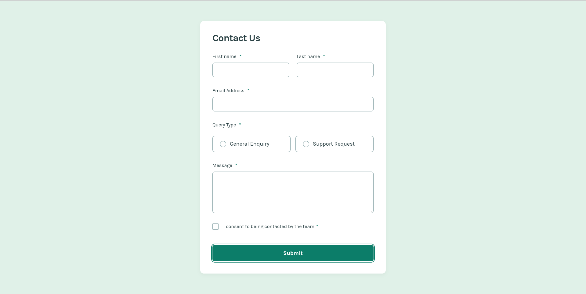

# Frontend Mentor - Contact form solution

This is a solution to
the [Contact form challenge on Frontend Mentor](https://www.frontendmentor.io/challenges/contact-form--G-hYlqKJj).
Frontend Mentor challenges help you improve your coding skills by building realistic projects.

## Table of contents

- [Overview](#overview)
    - [The challenge](#the-challenge)
    - [Screenshot](#screenshot)
    - [Links](#links)
- [My process](#my-process)
    - [Built with](#built-with)
    - [What I learned](#what-i-learned)
    - [Continued development](#continued-development)
    - [Useful resources](#useful-resources)
    - [AI Collaboration](#ai-collaboration)
- [Author](#author)
- [Acknowledgments](#acknowledgments)

## Overview

### The challenge

Users should be able to:

- Complete the form and see a success toast message upon successful submission
- Receive form validation messages if:
    - A required field has been missed
    - The email address is not formatted correctly
- Complete the form only using their keyboard
- Have inputs, error messages, and the success message announced on their screen reader
- View the optimal layout for the interface depending on their device's screen size
- See hover and focus states for all interactive elements on the page

### Screenshot



### Links

- Solution URL: [https://github.com/async-kita/contact-form](https://github.com/async-kita/contact-form)
- Live Site URL: [https://async-kita.github.io/contact-form/](https://async-kita.github.io/contact-form/)

## My process

### Built with

- Semantic HTML5 markup
- CSS custom properties
- Flexbox & CSS Grid
- Mobile-first workflow
- Vanilla JavaScript (no frameworks)
- Custom accessible form components (radio, checkbox)
- ARIA attributes and screen-reader testing
- Smooth animation for error messages

### What I learned

This challenge was a deep dive into **accessible forms**. Here are a few highlights:

- **Custom radio buttons & checkboxes with full keyboard support:**  
  I used `:has()` CSS selector to style custom radio cards and a custom checkbox. Native inputs are visually hidden but
  remain accessible for screen readers and keyboard navigation.
  ```css
  .radio-card:has(.radio-card__input:checked) {
    background-color: var(--clr-green-200);
    border-color: var(--clr-green-600);
  }
  ```

### Continued development

- Live inline validation: I’d like to experiment with validating fields on blur (blur event) instead of only on submit,
  while still keeping it non-intrusive.
- Advanced CSS techniques: I used :has() which is modern and powerful, but I want to explore fallback strategies for
  older browsers.
- Testing with actual screen readers: I relied on ARIA best practices, but I plan to test with NVDA/VoiceOver to confirm
  the announcements are perfectly timed.
- Micro-interactions: Adding subtle animations to the toast entrance/exit and focus rings could enhance the polish.

### Useful resources

### AI Collaboration

## Author

- Website - [https://github.com/async-kita](https://github.com/async-kita)
- Frontend Mentor - [@async-kita](https://www.frontendmentor.io/profile/async-kita)

## Acknowledgments

This is where you can give a hat tip to anyone who helped you out on this project. Perhaps you worked in a team or got
some inspiration from someone else's solution. This is the perfect place to give them some credit.

